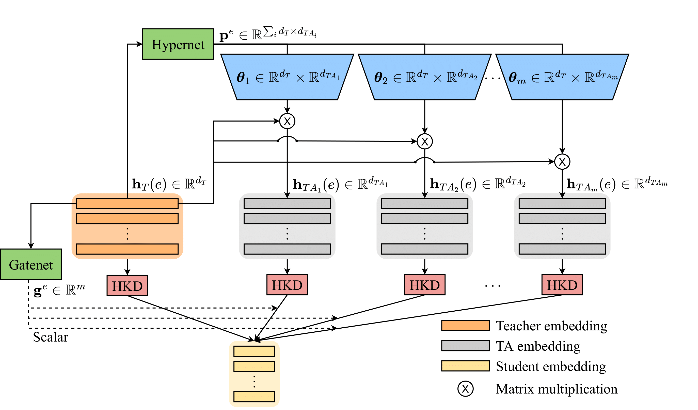
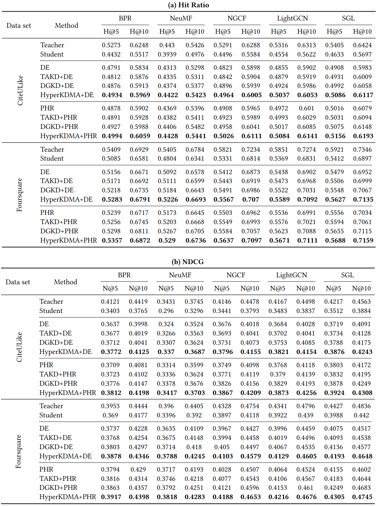

# HyperKDMA: Distilling Recommender Systems via Hypernetwork-based Teacher Assistants
<div align="center">

</div>

## Overview
This is the implementation for our paper [HyperKDMA: Distilling Recommender Systems via Hypernetwork-based Teacher Assistants](./HyperKDMA.pdf). In this work, we propose HyperKDMA, a distillation scheme using multiple hypernetwork-based teacher assistants to bridge the teacher-student gap in knowledge distillation for top-K recommendation. We verify the effectiveness of our method through experiments using three base models: [BPR](https://https://arxiv.org/abs/1205.2618), [NeuMF](https://https://arxiv.org/abs/1708.05031) and [LightGCN](https://https://arxiv.org/abs/2002.02126); and two public data sets: [CiteULike](https://https://github.com/js05212/citeulike-t) and [Foursquare](https://https://sites.google.com/site/yangdingqi/home/foursquare-dataset).

## Usage
1. Generate datasets
   ```sh
   python3 gen_dataset_seed.py
   ```
   Then dataset files will be generated in the folder `datasets`.
2. Train a teacher model
   ```sh
   python3 main_no_KD --model BPR --dim 200 --dataset CiteULike 
   ```
3. Now you have different ways to train a student model, for example:
   * Train a student model without KD
      ```sh
      python3 main_no_KD --model BPR --dim 20 --dataset CiteULike 
      ```
   * Train a student model with KD using DE
     ```sh
     python3 main_DE --model BPR --teacher_dim 200 --student_dim 20 --dataset CiteULike
     ```
   * Train a student model with KD using HyperKDMA-DE 
     ```sh
     python3 main_DETA --model BPR --teacher_dim 200 --student_dim 20 --num_TAs 8 --dataset CiteULike
     ```

## Results
We compare our model with the following competitors: [Distillation Experts (DE)](https://doi.org/10.1145/3340531.3412005), [Personalized Hint Regression (PHR)](https://doi.org/10.1016/j.knosys.2021.107958), [Knowledge Distillation via Teacher Assistant(TAKD)](https://doi.org/10.1609/aaai.v34i04.5963), and [Densely Guided Knowledge Distillation (DGKD)](10.1109/ICCV48922.2021.00926). Our model HyperKDMA significantly outperforms other KD methods thanks to the personalized learning mechanism.
<div align="center">

</div>
